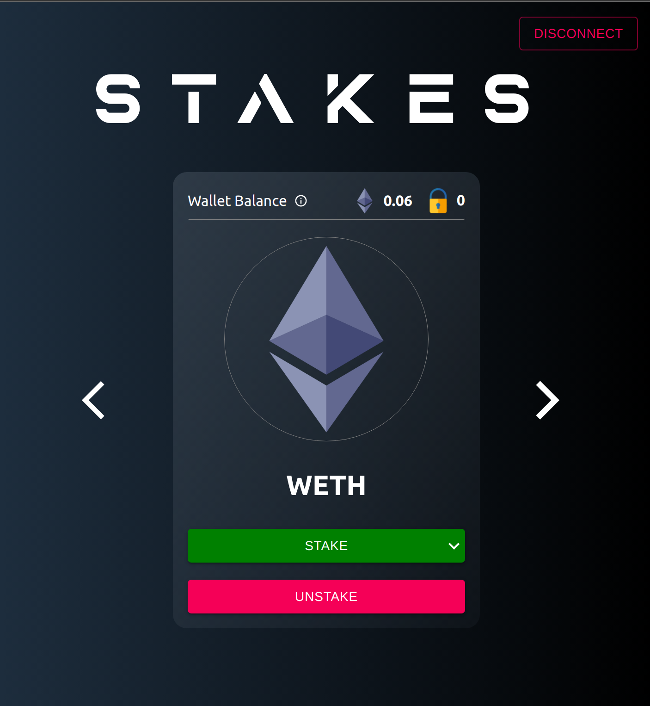

# Stakes 👻

_Stakes is a full-stack dApp built using **Solidity** and **React** that
allows users to stake and unstake ERC-20 tokens, in
exchange for the platform native cryptocurrency on the
**Kovan** testnet._
<br/>
<br/>
_The smart contracts were tested and deployed using **Brownie**._

<p align="center">

&nbsp;
&nbsp;
&nbsp;

## Getting Started

Navigate to `front-end` in the main project directory:

1. Download all necessary dependencies mentioned in `package.json`:

```
$ yarn install
```

2. Start the application with a local server:

```
$ yarn start
```

## Configuration

The smart contracts can be interacted with through `Brownie`.

1. You will require the following details for custom configuration:

- Crypto Wallet Private key (Metamask)
- Infura Project ID
- Etherscan API Token (Optional)

Create a `.env` file in the main project directory in the following format:

```
export PRIVATE_KEY={CRYPTO_WALLET_PRIVATE_KEY}
export WEB3_INFURA_PROJECT_ID={INFURA_ID}
export ETHERSCAN_TOKEN={ETHERSCAN_API_TOKEN}
```

2. Currently the front-end application is supported and the smart contracts are deployed on the `Kovan` testnet. To extend the list of supported networks, edit the `config` object under the `DappProvider` hook in `./front_end/src/app.tsx`.
   <br/>
   <br/>
3. If smart contracts are edited or deployed to a new testnet, the `front_end/src/chain_info` directory has to be updated for appropriate contract calls from the front-end with the following command in the main project directory:

```
brownie run scripts/update_front_end.py
```

_***Note***: The native token DAPP in this application has no value whatsoever and it is not suggested in any way to invest your ***real*** funds in this token. This application was built for pure research purposes._
